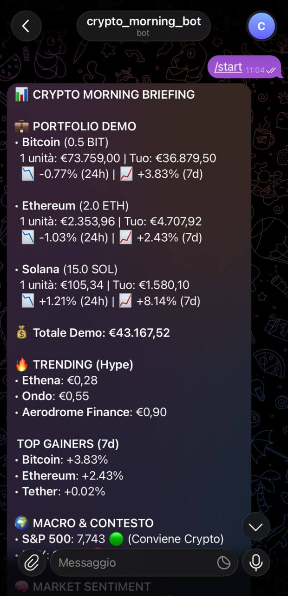
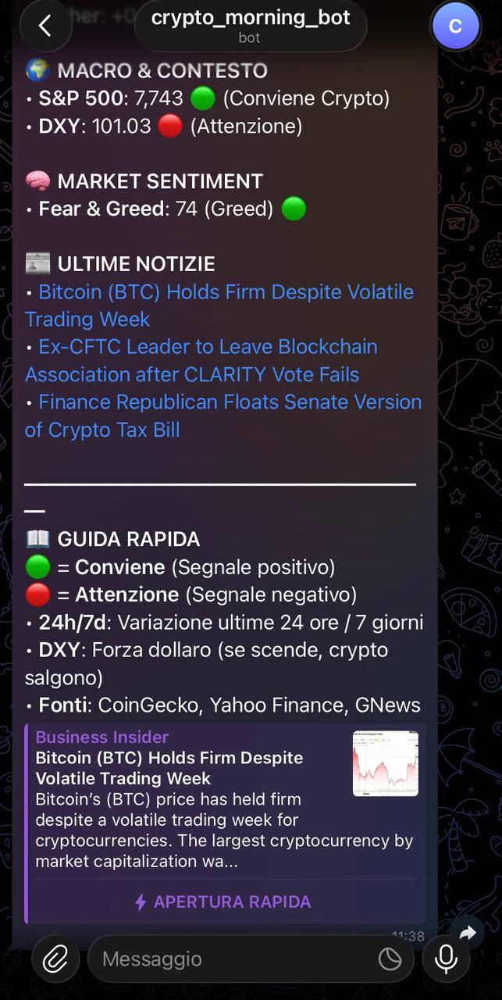

# 🤖 Crypto Morning Bot

**Smetti di aprire 10 app per controllare i mercati.**
Ottieni un report professionale, sintetico e azionabile direttamente su Telegram ogni mattina alle 07:30.

### 📱 Il tuo briefing mattutino

---

##  Perché questo Bot?

Il mercato crypto e macroeconomico è rumoroso. Questo strumento elimina la dispersione e ti fornisce un quadro chiaro prima dell'apertura delle borse.

- 💼 **Il Tuo Portafoglio sotto controllo:** Monitora il valore reale e le variazioni (24h e 7d) delle tue asset.
- 🔥 **Anticipa i Trend:** Scopri quali crypto stanno generando hype e quali hanno le migliori performance settimanali.
- 🌍 **Contesto Macro Intelligente:** Non solo numeri. Il bot interpreta S&P 500 e DXY (Dollaro) per dirti se il clima è favorevole o rischioso per le crypto.
- 📰 **Notizie Mirate:** Le 3 notizie più rilevanti del giorno, senza clickbait.

## 🚀 Come ottenerlo

Il bot è completamente personalizzabile. Puoi scegliere quali crypto monitorare, impostare il tuo portafoglio reale e decidere l'orario di consegna.

**Interessato a una demo o all'installazione?**
Contattami su [LinkedIn](www.linkedin.com/in/andrea-stella-211479413) o via Telegram per parlarne.

---

🛠️ <b>Dettagli Tecnici (Per Sviluppatori e Recruiter)</b>

Il progetto è costruito per essere serverless, gratuito e robusto.

- **Stack:** Python 3.10, GitHub Actions (Cron Job).
- **API:** CoinGecko, Alternative.me, GNews, Yahoo Finance.
- **Sicurezza:** Zero credenziali hardcoded (uso di GitHub Secrets).
- **Robustezza:** Architettura con `try-except` per garantire l'invio del report anche in caso di down di una singola API.

**Setup Rapido:**
1. Clona il repository.
2. Ottieni i token da Telegram (`@BotFather`) e GNews.
3. Inseriscili nei GitHub Secrets.
4. Personalizza il `config.json`.

